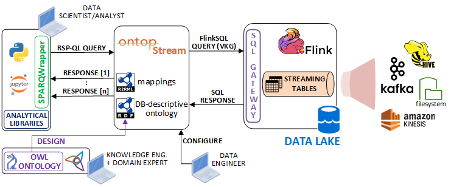

# OntopStream running example

## Overview

To encourage the adoption of OntopStream, we have decided to provide a running example that simulates an entire analytical pipeline based on the "New York Taxi dataset" of the Ververica's [sql-training repository](https://github.com/ververica/sql-training). The data streams, managed in Apache Kafka, are ingested by Flink and accessed through the S-OBDA paradigm with OntopStream, in the way showed in the figure below.. Data Scientists and Data Analysts can use the demo notebook to execute a set of RSP-QL analytical queries over the OntopStream endpoint. Moreover, Knowledge and Data engineers can learn how to configure and deploy the OntopStream docker endpoint by looking to the `.yml` files and the Setup section.



## Setup and Execution

### 1. Start the producer (Kafka and Flink)

```
sudo docker-compose -f flink-kafka.yml up -d
```

### 2. Start the REST endpoint

Start the REST endpoint service

```
sudo docker-compose -f flink-kafka.yml exec sql-client /opt/flink-sql-gateway-0.2-SNAPSHOT/bin/sql-gateway.sh --library /opt/sql-client/lib
```

__Note(1)__: keep the REST endpoint alive until you need the service (don't close the terminal window).

__Note(2)__: the JDBC driver mappings are persisted on the local file [sql-gateway-defaults.yaml](./flink/flink-sql-gateway-0.2-SNAPSHOT/conf/sql-gateway-defaults.yaml), which is automatically loaded on startup in the `sql-client` docker image.

### 3. Start OntopStream

Open a ___new terminal window___, then run the command:

```
sudo docker-compose -f ontop.yml up -d
```

__Note__: the OntopStream's DB-descriptive ontology and mapping files are stored in the `taxiRides` folder.

### 4. Start Jupyter

```
sudo docker-compose -f jupyter.yml up -d
```
It starts a JupyterLab environment.

You can copypaste the link `http://127.0.0.1:8888/lab?token=TEST` on your browser to access the JupyterLab web UI (`127.0.0.1` means `localhost`).

Run the examples inside the demo notebook loaded (`OntopStream_user_notebook.ipynb`).

### 5. Stop the demo environment (end of the demo...)

To close the Flink REST service endpoint, press `CTRL+C` and type `EXIT` to leave the terminal.

Then, you can terminate all the instances, using the following commands:

```
sudo docker-compose -f jupyter.yml down

sudo docker-compose -f ontop.yml down

sudo docker-compose -f flink-kafka.yml down
```

## Additional Tools

Flink's built-in shell to run FlinkSQL queries to compare with the stream of (relational) data in the streaming tables.

```
sudo docker-compose -f flink-kafka.yml exec sql-client ./sql-client.sh
```
